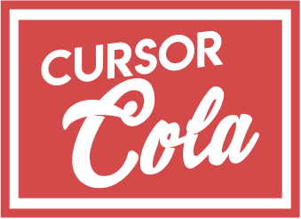

# Cursor Cola

a small fizz for all your cursor needs

visit this [site](https://bottleneckstudio.github.io/CursorCola/) to check the css syntax of each pointers or download our 1kb css file [here](https://github.com/BottleneckStudio/CursorCola)

